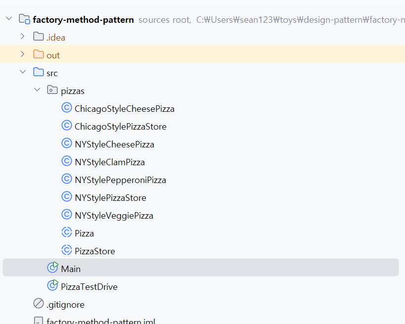

## 팩토리 패턴 
객체 '생성'을 캡슐화하는 패턴

### 팩토리 메소드 패턴
객체를 생성할 때 필요한 인터페이스를 만드는 패턴

인스턴스를 만드는 일은 서브클래스가 하도록 함 

#### 나만의 정의
- 상속을 사용하는 팩토리 패턴
- 각 서브 클래스는 각각의 부모 클래스를 상속해서 만들어지고, 인스턴스를 직접 생성한다

### 관련된 객체지향 원칙
- 바뀌는 부분은 캡슐화한다
- 상속보다는 구성을 활용한다
- 구현보다는 인터페이스에 의존한다
- 상호작용하는 객체들은 느슨하게 결합해야 한다
- 클래스는 확장에는 열려 있어야 하지만, 변경에는 닫혀 있어야 한다 (OCP)
- **추상화된 것에 의존하게 만들고 구체 클래스에 의존하지 않게 만든다**